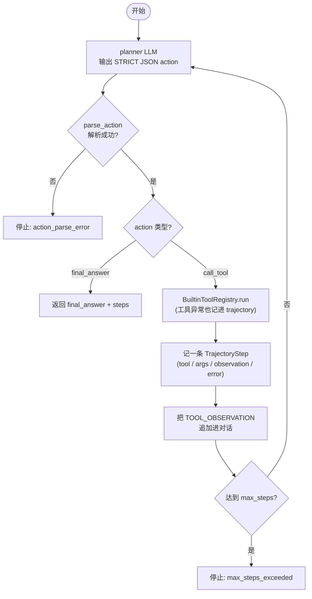
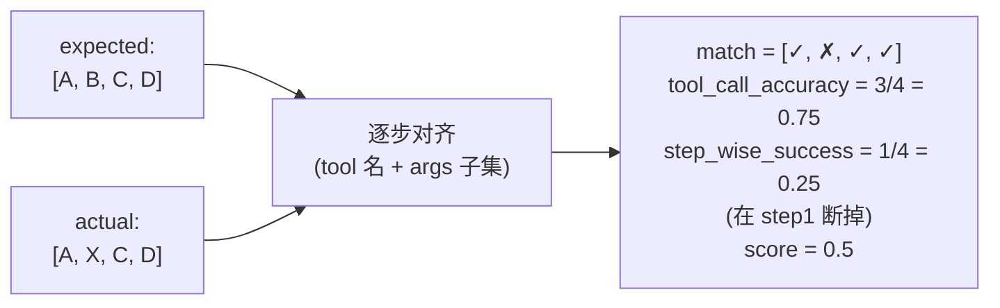

# Phase 9 技术方案 · Agent Trajectory Evaluator（Tool Runtime）

## 一句话

当 `task_type=agent` 时，runner 不再复用通用 judge，而是走 `AgentTrajectoryEvaluator`：在 evaluator 内部跑一个**真实的 tool runtime（工具运行时）**产出 `actual_trajectory`，再与 case 上的 `expected_trajectory` 对齐，做 **trajectory eval（轨迹评测，按动作序列而非最终答案打分）**，算出 `tool_call_accuracy` 与 `step_wise_success` 两项指标，并通过 `quality.sub_metrics` 进 gate。

核心理念：Agent 的好坏不在「最后那句答案」，而在「中间每一步工具调用对不对、顺序对不对」。所以要评的是动作序列。

## 整体架构与数据流

## AgentRuntime：planner 决策循环

`AgentRuntime`（[`src/evalgate/evaluator/agent/runtime.py`](../src/evalgate/evaluator/agent/runtime.py)）是一个最多 `max_steps` 轮的 planner loop：每轮让 planner LLM 输出严格 JSON 动作，要么调工具、要么给最终答案；调工具就执行并把 observation 喂回去，进入下一轮。

模块布局（[`src/evalgate/evaluator/agent/`](../src/evalgate/evaluator/agent/)）：`parser.py`（严格 JSON action 解析）、`tools.py`（`BuiltinToolRegistry`：`lookup_invoice` / `fetch_policy` / `get_payment_attempts`）、`runtime.py`（上面的循环）、`evaluator.py`（对齐与打分）、`types.py`（`ParsedAction` / `TrajectoryStep` / `AgentRuntimeResult`）。

在 [`router.py`](../src/evalgate/evaluator/router.py) 里，`spec.agent_runtime is not None` 时注册 `TaskKind.agent -> AgentTrajectoryEvaluator`；未配置则继续保持 `unsupported_task_type` 的 per-case error 语义（不污染整 run）。

## 打分算法：actual_trajectory vs expected_trajectory

对齐按 step 下标逐一比对，每步的「匹配」= **工具名严格相等 AND args 子集匹配**（expected 是 actual 的深度子集即算过——允许 actual 携带额外字段）。

由匹配标志 `match_flags` 推出两项指标：

- **`tool_call_accuracy`**：匹配步数 / expected 步数。衡量「整体上对了几步」，不在乎顺序断点。
- **`step_wise_success`**：从头连续匹配的前缀长度 / expected 步数，**遇到首个 mismatch 即截断**。衡量「在出错前能正确走多远」。
- **`score = (tool_call_accuracy + step_wise_success) / 2`**。

这个例子点出两项指标的互补：3/4 步最终都对了（accuracy 高），但第 2 步就走岔了（step-wise 低）——对 Agent 来说「中途走错」往往比「零散漏一步」更致命。

## Schema：不加新 result 列

只给 `eval_cases` 加一列 `expected_trajectory: list[dict]`（JsonType，NOT NULL，default `[]`，migration `0009`，SQLite 走 `batch_alter_table`）。**实际轨迹不另开列**，而是塞进已有的 `judge_raw.actual_trajectory` 与 `eval_judge_calls.raw`，避免为 agent 单独冗余 schema。两项指标则通过 `EvaluationOutcome.axis_breakdown["quality"]` 进 `quality.sub_metrics`，复用 Phase 8 已经建好的 sub-metric 嵌套与 gate 判定通路。

字段沿调用链贯通：`core/schemas.py`（`EvalCaseOut.expected_trajectory`）→ repository 的 `add_case` / `add_case_from_trace` → REST `CreateCaseRequest` → CLI（新增 `evalgate eval-set add-agent-case --step <JSON>`）。

## 从 trace 自动补轨迹初稿

[`ingest/case_extract.py`](../src/evalgate/ingest/case_extract.py) 的 `_extract_expected_trajectory` 从 `evalgate.kind=tool` 的 spans 按时间顺序抽取工具调用，工具名/args 都做多 key 容错读取（`tool.name` / `gen_ai.tool.name` / ...）。这样 `add_case_from_trace` 能用真实 production trace 自动生成 `expected_trajectory` 初稿，人工再微调，而不必从零手写。

## 技术选型与抉择

**1. 轨迹来源：真实 runtime 执行，而非让模型「自报轨迹」（ADR-005）**

最直接的做法是让 planner LLM 直接输出「我会调用 A、B、C」然后比对这段自述。但模型的「自报计划」和它「实际会做的」常常不一致——自报轨迹评的是模型的叙述能力，不是 Agent 行为。因此选择在 evaluator 内跑真实的 tool runtime，用真实执行轨迹去对齐。这正是 ADR-005「Agent → trajectory eval（tool-call accuracy + step-wise success）」的落地：不同任务类型必须用匹配其失效模式的 evaluator。

**2. 两项指标并存：accuracy（全局）+ step-wise（前缀）**

只用 `tool_call_accuracy` 会漏掉「顺序错」这一 Agent 的典型失效——零散对了几步但中途走岔，对真实任务通常是失败的。`step_wise_success` 用前缀连续成功率捕捉「出错前能走多远」，与 accuracy 互补。两者平均成 score，让 gate 既看整体命中也看是否中途崩。

**3. 匹配口径：tool 名严格 + args 子集（expected ⊆ actual）**

工具名要求严格相等（v1 不做语义同义工具映射，避免「近似工具」放水）；但 args 只要求 expected 是 actual 的深度子集，允许实际调用携带额外/默认参数，使断言既稳又不过脆。

**4. planner 输出走 strict JSON contract，而非 provider function-calling**

不依赖各家 provider 的原生 function-calling 协议，而是用统一的 strict JSON 动作契约（`{"action":"call_tool",...}` / `{"action":"final_answer",...}`）。这样换 provider/模型不必改 runtime，CI 也能用确定性 mock 跑通整个循环。

**5. 工具用 deterministic builtin mock**

内置工具是确定性 mock 实现，便于 CI 与 smoke 可重现；后续可替换成真实业务工具 registry，runtime 与 evaluator 都不必动。

**6. 复用 Postgres + JSONB 存轨迹（ADR-002）**

`expected_trajectory`、`judge_raw.actual_trajectory`、`eval_judge_calls.raw` 都是结构不固定的嵌套 JSON，用 JSONB 列承载最自然，无需为 agent 额外建关系表——与 ADR-002 一致。

## 已知边界

- v1 不做并行工具调用，不做语义同义工具映射。
- 工具是 builtin mock；真实业务工具留待后续接入。

## 测试策略

围绕 runtime（mock loop / max_steps / action parse error）、对齐打分（缺失轨迹报错、args 子集匹配、中间步骤错导致分数下降）、ORM/REST round-trip、runner 端到端落库与 unsupported 分支、trace 抽取 `expected_trajectory`、以及 agent sub-metrics 在 quality 下正确聚合做覆盖，全程 mock，离线可重现。
