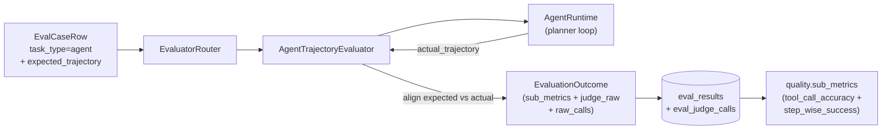
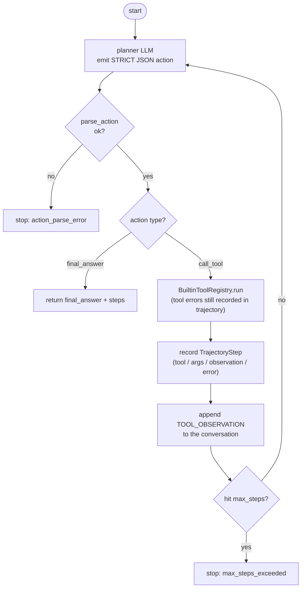
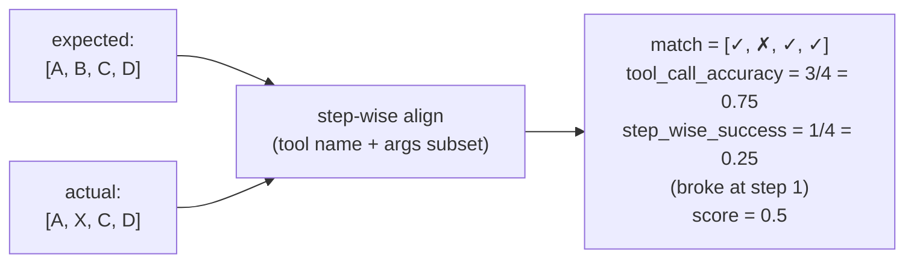

# Phase 9 design · Agent Trajectory Evaluator (Tool Runtime)

## In one sentence

When `task_type=agent`, the runner no longer reuses the generic judge. It uses `AgentTrajectoryEvaluator`: inside the evaluator a **real tool runtime** produces `actual_trajectory`, aligned against the case's `expected_trajectory`, for **trajectory eval** (score the action sequence, not the final answer). It emits `tool_call_accuracy` and `step_wise_success`, which enter the gate via `quality.sub_metrics`.

Core idea: an agent's quality is not "the last sentence," but "whether each intermediate tool call was right, in the right order." What we evaluate is the action sequence.

## Architecture and data flow

## AgentRuntime: planner decision loop

`AgentRuntime` ([`src/evalgate/evaluator/agent/runtime.py`](../src/evalgate/evaluator/agent/runtime.py)) is a planner loop of at most `max_steps` rounds: each round the planner LLM emits a strict JSON action, either calling a tool or giving a final answer; a tool call is executed and the observation is fed back for the next round.

Module layout ([`src/evalgate/evaluator/agent/`](../src/evalgate/evaluator/agent/)): `parser.py` (strict JSON action parse), `tools.py` (`BuiltinToolRegistry`: `lookup_invoice` / `fetch_policy` / `get_payment_attempts`), `runtime.py` (the loop above), `evaluator.py` (align and score), `types.py` (`ParsedAction` / `TrajectoryStep` / `AgentRuntimeResult`).

In [`router.py`](../src/evalgate/evaluator/router.py), when `spec.agent_runtime is not None`, register `TaskKind.agent -> AgentTrajectoryEvaluator`; if unconfigured, keep the `unsupported_task_type` per-case error semantics (do not poison the whole run).

## Scoring: actual_trajectory vs expected_trajectory

Alignment is step-index by step-index. A step "matches" if **tool name is strictly equal AND args are a subset match** (expected is a deep subset of actual—extra fields on actual are allowed).

From `match_flags`:

- **`tool_call_accuracy`**: matched steps / expected steps. "How many steps were right overall," ignoring where the sequence broke.
- **`step_wise_success`**: length of the contiguous matching prefix / expected steps; **cut at the first mismatch**. "How far it walked correctly before the first error."
- **`score = (tool_call_accuracy + step_wise_success) / 2`**.

This example shows the two metrics complement: 3/4 steps eventually matched (high accuracy) but step 2 already diverged (low step-wise)—for agents, "went wrong mid-way" is often more fatal than "missed one scattered step."

## Schema: no new result columns

Only add `expected_trajectory: list[dict]` on `eval_cases` (JsonType, NOT NULL, default `[]`, migration `0009`, SQLite via `batch_alter_table`). **Actual trajectory does not get its own column**; it goes into existing `judge_raw.actual_trajectory` and `eval_judge_calls.raw`, avoiding an agent-only redundant schema. The two metrics enter `quality.sub_metrics` via `EvaluationOutcome.axis_breakdown["quality"]`, reusing Phase 8's nested sub-metric and gate path.

Fields flow along the call chain: `core/schemas.py` (`EvalCaseOut.expected_trajectory`) → repository `add_case` / `add_case_from_trace` → REST `CreateCaseRequest` → CLI (new `evalgate eval-set add-agent-case --step <JSON>`).

## Auto-draft trajectory from a trace

`_extract_expected_trajectory` in [`ingest/case_extract.py`](../src/evalgate/ingest/case_extract.py) pulls tool calls from `evalgate.kind=tool` spans in time order, with multi-key fallbacks for tool name/args (`tool.name` / `gen_ai.tool.name` / ...). `add_case_from_trace` can thus auto-draft `expected_trajectory` from a real production trace for humans to tweak, instead of writing from scratch.

## Technical choices

**1. Trajectory source: real runtime execution, not the model "self-reporting" a plan (ADR-005)**

The naive approach is to have the planner LLM emit "I would call A, B, C" and compare that narrative. A model's self-reported plan often disagrees with what it would actually do—that scores narration, not agent behavior. So we run a real tool runtime inside the evaluator and align against the executed trajectory. That is ADR-005 "Agent → trajectory eval (tool-call accuracy + step-wise success)": each task type needs an evaluator that matches its failure mode.

**2. Two metrics together: accuracy (global) + step-wise (prefix)**

`tool_call_accuracy` alone misses "wrong order," a typical agent failure—scattered correct steps with a mid-sequence fork usually fail the real task. `step_wise_success` uses contiguous prefix success to capture "how far before the first error," complementary to accuracy. Averaging them into score lets the gate see both overall hits and mid-run collapse.

**3. Match rule: strict tool name + args subset (expected ⊆ actual)**

Tool names must be strictly equal (v1 has no semantic synonym mapping, so "almost the same tool" cannot pass). Args only require expected to be a deep subset of actual, allowing extra/default parameters so assertions are stable without being brittle.

**4. Planner output is a strict JSON contract, not provider function-calling**

We do not depend on each provider's native function-calling protocol. A unified strict JSON action contract (`{"action":"call_tool",...}` / `{"action":"final_answer",...}`) means swapping provider/model does not change the runtime, and CI can drive the whole loop with deterministic mocks.

**5. Tools are deterministic builtin mocks**

Builtin tools are deterministic mocks for CI and smoke reproducibility; later they can be replaced by a real business tool registry without changing runtime or evaluator.

**6. Reuse Postgres + JSONB for trajectories (ADR-002)**

`expected_trajectory`, `judge_raw.actual_trajectory`, and `eval_judge_calls.raw` are nested JSON of unfixed shape—JSONB is the natural store, with no extra relational tables for agents, consistent with ADR-002.

## Known limits

- v1 has no parallel tool calls and no semantic synonym mapping for tools.
- Tools are builtin mocks; real business tools wait for a later integration.

## Test strategy

Coverage: runtime (mock loop / max_steps / action parse error), alignment scoring (missing trajectory errors, args subset match, mid-step errors lower the score), ORM/REST round-trip, runner end-to-end persist and the unsupported branch, trace extraction of `expected_trajectory`, and agent sub-metrics aggregating correctly under quality. Fully mocked, offline-reproducible.
