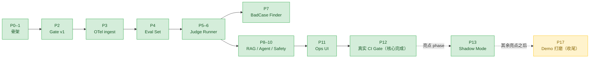
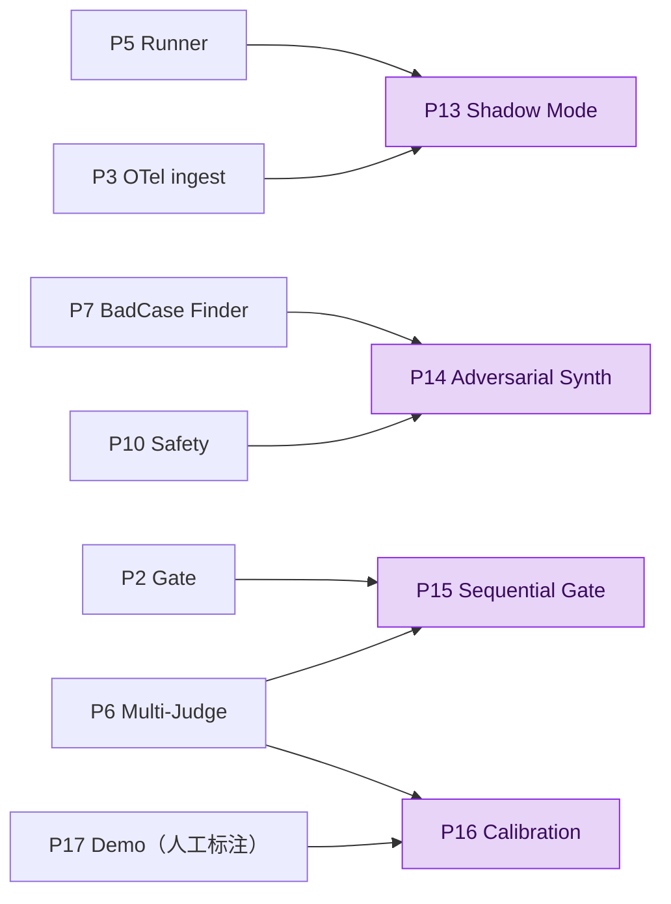

# EvalGate · Roadmap

> 每个 phase 约 **1 人天** 的 vibe coding 工作量。每个 phase 之间是 "可独立 demo / 可独立交付" 的，
> 不会出现 "phase X 没做完，phase X+1 跑不动" 的依赖。
>
> **状态约定**：`[DONE]` 已交付（commit 已合）/ `[NEXT]` 下一步要做 / `[TODO]` 之后排队。
> 完成一个 phase 就把状态改成 `[DONE]`，并在 [`JOURNAL.md`](../JOURNAL.md) 加一条里程碑记录。
> 如果在执行中调整了路线（合并 / 拆分 / 换顺序），更新本文件并在 [`DECISIONS.md`](../DECISIONS.md) 记原因。
>
> **总体节奏**：核心交付线 **Phase 0–12 已全部完成**，即达到 design.md 描述的完整形态；亮点线已落地第一站 **Phase 13 Shadow Mode**。之后按需继续做 **亮点 phase**（后端 / 平台向推荐 **14 → 15**，Phase 16 暂缓）拉高简历与面试深度；**最后**用 **Phase 17 Demo 打磨**（录屏 + 最终数字，≈ 1 人天）一次性收尾打包——放最后是为了覆盖到所有已建功能。

---

## 进度总览

| 阶段 | 名称 | 状态 |
|---|---|---|
| Phase 0 | 仓库 bootstrap | `[DONE]` |
| Phase 1 | Walking skeleton（FastAPI + DB + OTel mapper） | `[DONE]` |
| Phase 2 | 多轴 CI Gate v1（fixtures 驱动） | `[DONE]` |
| Phase 3 | OTel 端到端 + Trace 浏览 API | `[DONE]` |
| Phase 4 | Eval Set Manager | `[DONE]` |
| Phase 5 | Generic LLM-as-Judge Runner v1 | `[DONE]` |
| Phase 6 | Judge Robustness（cross-vote + position-swap + self-consistency） | `[DONE]` |
| Phase 7 | BadCase Finder（uncertainty + outlier） | `[DONE]` |
| Phase 8 | RAG-aware Evaluator（RAGAS） | `[DONE]` |
| Phase 9 | Agent Trajectory Evaluator | `[DONE]` |
| Phase 10 | Safety 轴（PII + jailbreak） | `[DONE]` |
| Phase 11 | Streamlit Ops UI v1 | `[DONE]` |
| Phase 12 | 真实 CI Gate 端到端（替换 fixtures） | `[DONE]` |
| Phase 13 | Shadow Mode（影子模式） | `[DONE]`（亮点 · 推荐 #1） |
| Phase 14 | Adversarial Synth（对抗出题） | `[TODO]`（亮点 · 推荐 #2）← 下一步 |
| Phase 15 | Sequential Gate（序贯 gate） | `[TODO]`（亮点 · 推荐 #3） |
| Phase 16 | Judge Calibration（标定） | `[TODO]`（暂缓 / ML 研究向） |
| Phase 17 | Demo 打磨（数据 + 录屏 + 数字） | `[TODO]`（最后收尾 · 打磨数字 / 录屏） |

核心 phase 是一条线性流水线，每个都建立在前一个之上：

---

## Phase 0 · 仓库 bootstrap   [DONE]

- **目标**：可工作的 Python 仓库骨架，CI 跑通。
- **已交付**：`uv` + `ruff` + `pytest` + `pre-commit` + `docker-compose`（Postgres）+ GitHub Actions lint/test workflow + Apache-2.0 license + Dockerfile。
- **commit**：`642e8fe chore: bootstrap project (uv, ruff, pytest, docker-compose, CI)`

## Phase 1 · Walking skeleton（FastAPI + DB + OTel mapper）   [DONE]

- **目标**：trace 能写进 Postgres；最小可运行的服务端。
- **已交付**：FastAPI app（`/healthz`、`/v1/traces` ingest 端点）+ async SQLAlchemy + Alembic 初始 migration + OTel span → 内部 schema 的 mapper + 对应单测。
- **commit**：`039d9fc feat(api,db,ingest): walking skeleton — FastAPI app, async SQLAlchemy, Alembic, OTel mapper`

## Phase 2 · 多轴 CI Gate v1（fixtures 驱动）   [DONE]

- **目标**：CLI `evalgate gate` 跑通，PR 上能看到四轴报告 + tag 归因。
- **已交付**：`build_gate_report` 把 baseline/candidate JSON 算成 4 轴 metric（quality / cost / latency_p95 / safety）+ bootstrap diff CI + tag-wise attribution + GitHub Actions 自动评论 PR + 失败时阻塞 merge + demo seeder（在 billing tag 上注入 regression）。
- **commit**：`be3a749 feat(gate): end-to-end multi-axis CI gate with bootstrap CI + tag attribution`

## Phase 3 · OTel 端到端打通 + Trace 浏览 API   [DONE]

- **目标**：装上 OTel SDK 的真实 demo app 把 span 推到 EvalGate，DB 里能查到，REST API 能 list/detail。
- **已交付**：
  - `examples/demo_app/`：最小 Python LLM 流程（`litellm` + `mock_response`，零 API key），手写 OTel SDK + `OTLPSpanExporter` 推到 `/v1/otel/traces`。
  - `POST /v1/otel/traces` 同时接 `application/x-protobuf`（OTel SDK 默认）和 `application/json`（curl 调试友好），解析后落库 `traces` + `spans` 两表，幂等。
  - `GET /v1/traces?limit=&since=&service=` 分页列表 + `GET /v1/traces/{trace_id}` 完整 span tree 详情。
  - 持久化层 `ingest/persistence.py` 抽出 SQLite/PG 双方言的 `INSERT ... ON CONFLICT`；`traces` 汇总按 spans 表实时重算（replay 不会双计）。
  - 7 个新单测（protobuf ingest、JSON ingest、idempotency、list/detail、404）+ 现有 endpoint 测试改成真断言 DB 状态。
  - 测试用 aiosqlite in-memory engine fixture（`tests/conftest.py`），CI 不依赖 Postgres。
  - `make demo-trace`：起 DB → migrate → 启 API → 跑 demo → curl 列表 → 清理。
- **commit**：（待 commit；本地端到端 demo 已验证：3 span trace 推上去，list/detail 都返回正确 payload）
- **决策对齐**：完整落地 ADR-001（OTLP wire）+ ADR-002（PG/JSONB/Alembic）。
- **详细技术方案**：见 [docs/PHASE_3_PLAN.md](./PHASE_3_PLAN.md)。

## Phase 4 · Eval Set Manager   [DONE]

- **目标**：能把任何一条 case（来自 trace 或手工）"加入 eval set"，并按 tag 组织。
- **已交付**：
  - DB schema：`eval_sets`、`eval_cases`（`input` / `expected` / `tags`(JSONB list) / `source_trace_id`(软引用) / `source_span_id` / `task_type` enum: rag / agent / generic）+ 0003 Alembic migration + FK CASCADE。
  - REST：`POST /v1/eval-sets`、`GET /v1/eval-sets`、`GET /v1/eval-sets/{id_or_name}`、`POST /v1/eval-sets/{id}/cases`、`POST /v1/eval-sets/{id}/cases/from-trace/{trace_id}`。
  - CLI：`evalgate eval-set create / add / show`（直连 DB，`--set` 接 UUID 或 name）。
  - 抽 case 策略：从 trace 找第一个 LLM span（`evalgate.kind=llm` OR 任意 `gen_ai.*` attribute），把 prompt → `case.input`、response → `case.expected`；`task_type` 按 trace 里是否有 retriever / 多个 tool span 启发式推断。
  - 24 个新单测（pure function + REST + CLI + 404/422 路径），全部跑在 aiosqlite fixture 上不依赖 docker。
  - 退出标准：本地 promote 5 trace → 5 case，REST + CLI 都返回正确 payload。
- **commit**：（待 commit）
- **详细技术方案**：见 [docs/PHASE_4_PLAN.md](./PHASE_4_PLAN.md)。

## Phase 5 · Generic LLM-as-Judge Runner v1（LiteLLM）   [DONE]

- **目标**：给一个 eval set + 一个 prompt（候选版本），跑 judge 出结果。
- **已交付**：
  - `src/evalgate/judge/`：`prompt_spec` / `candidate` / `rubric_judge` / `persistence` / `runner` 五件套；`RubricJudge` 三层解析（JSON → regex → score=0 兜底）。
  - `evalgate run --eval-set X --prompt p.yaml --out r.json [--judge-model ...] [--mock] [--limit N]`，输出 JSON 字段对齐 Phase 2 `gate` 入参。
  - 两张新表 `eval_runs` / `eval_results` + 0004 migration；`judge_confidence` + `judge_raw` 字段为 Phase 16 Calibration 预留。
  - `core/schemas.py` 加 `EvalRecord` pydantic model 固化 gate / shadow（Phase 13）的字段契约。
  - 19 个新测试（72/72 全绿）：prompt_spec、rubric_judge、candidate、runner、runner→gate 端到端、CLI 端到端，全部走 aiosqlite + `mock_response`。
  - 本地 demo（真实 Ollama qwen2.5:7b，无 fixtures）：3 条 billing case，baseline vs candidate 两次 run → 4 轴 gate 报告齐全，latency_p95 12.7s → 1.3s 体现弱化 prompt 的真信号。
- **commit**：（待 commit）
- **详细技术方案**：见 [docs/PHASE_5_PLAN.md](./PHASE_5_PLAN.md)。

## Phase 6 · Judge Robustness（cross-vote + position-swap + self-consistency）   [DONE]

- **目标**：把 design.md 决策 2 的"四件套"中的去偏 + 降方差落地。
- **交付**：
  - `MultiJudge`：N 个 sub-judge 聚合 → `(score, confidence, votes, raw_calls)`，confidence = 内部稳定度 × 跨 judge 一致度。
  - `PositionSwapJudge` wrapper：A/B 互换两次取一致；冲突 → 0.5 + `agreement=False`。
  - `SelfConsistencyJudge`：K 次重打，`confidence = 1 - stdev / 0.5`。
  - `prompt.yaml` 改 `judges: [...] + judge_policy:`（**breaking**，旧单数 `judge:` 报错并附迁移示例）。
  - 新表 `eval_judge_calls`（0005 migration）：N×K×P 行/case，Phase 17/16 可直接 SQL 复盘。
  - `evalgate run --k / --concurrency / --policy-mode` 覆盖实验脚本用。
  - [scripts/phase6_variance.py](../scripts/phase6_variance.py) 真本机实测：single 0.0377 vs multi 0.0136（lower 即更稳）。
- **退出标准**：单测覆盖五种 wrapper + 迁移；本机 Ollama 真数据写 JOURNAL。
- **commit**：（待 commit）
- **详细技术方案**：见 [docs/PHASE_6_PLAN.md](./PHASE_6_PLAN.md)。

## Phase 7 · BadCase Finder（uncertainty sampling + outlier）   [DONE]

- **目标**：把 Phase 5/6 写到 `eval_results` 的 confidence/latency/cost 信号变成可执行的 active-learning 动作。
- **交付**：
  - [src/evalgate/badcase/finder.py](../src/evalgate/badcase/finder.py)：`BadCase` dataclass + `find_uncertainty / find_outlier / find_llm / find`。
  - [src/evalgate/badcase/repository.py](../src/evalgate/badcase/repository.py)：`promote_result_to_set` 写一条 `eval_case_set_memberships`（never duplicates payload），结构性 dedup via UniqueConstraint。
  - REST：`GET /v1/badcases?strategy=...` + `POST /v1/badcases/{eval_result_id}/promote`。
  - CLI：`evalgate badcase list --strategy {uncertainty|outlier|llm}` + `evalgate badcase promote --result <id> --eval-set <target>`。
  - 数据源选 A（仅 `eval_results`，**不加新表 for finder**）。
- **后置 refactor**（同 PR）：
  - **Phase 7.5**：promote 从 「复制 EvalCaseRow」改为「插 `eval_case_set_memberships`」N:N + 新 `AlreadyPromotedError`（409）。详见 [PHASE_7_PLAN.md 文末](./PHASE_7_PLAN.md)。
  - **Phase 4.5**：彻底删 `EvalCaseRow.eval_set_id`，membership 表成为唯一真理源（migration 0007 含可逆 downgrade）。`SameSetPromotionError` 取消，归并到 `AlreadyPromotedError`。
- **退出标准**：[scripts/phase7_badcase_smoke.py](../scripts/phase7_badcase_smoke.py) 走通：10 case → finder 拿 top-3 → promote 落 target set。全 123 测试绿。
- **commit**：（待 commit）
- **详细技术方案**：见 [docs/PHASE_7_PLAN.md](./PHASE_7_PLAN.md)。

## Phase 8 · RAG-aware Evaluator（RAGAS）   [DONE]

- **目标**：当 case 的 `task_type=rag` 时，走专用 evaluator。
- **已交付**：
  - 引入官方 `ragas>=0.2`（实测 0.2.15）+ `datasets` + `langchain-core`；`src/evalgate/evaluator/rag/ragas_adapter.py` 写 LiteLLMChatModel + LiteLLMEmbeddings 把 ragas 的 langchain 调用导向 `litellm.acompletion / aembedding`；mock 模式走 SHA-256 384-dim 伪向量，CI 不连 Ollama。
  - `EvaluatorRouter`（`src/evalgate/evaluator/router.py`）按 `TaskKind` 分派；Phase 8 注册 `generic`（Phase 5/6 MultiJudge 路径，搬到 `evaluator/generic.py`）+ `rag`；`agent` 留给 Phase 9 一行注册即可；`UnsupportedTaskTypeError` 不破坏整 run。
  - 重构：删除 `src/evalgate/judge/runner.py`，新 `src/evalgate/evaluator/runner.py` 用 `EvaluationOutcome` dataclass 统一所有 evaluator 的输出；CLI / scripts / 测试全切到 `evaluator.runner`。
  - 0008 migration：`eval_cases.retrieved_contexts`（金标 contexts）+ `eval_results.sub_metrics`（per-metric 分项）+ `eval_results.retrieved_contexts`（运行时检索结果，badcase 审计）。
  - `EmbeddingRetriever`（candidate 端动态检索）：corpus.json + numpy 余弦排序 + lazy embed cache + `top_k` clamp。
  - Gate 分项：`AxisMetric.sub_metrics: dict[str, AxisMetric] | None` 递归字段；`build_axis_metrics` 自动从 records 的 `sub_metrics` 派生 nested axes（每项 bootstrap CI），`quality.passed = passed AND all(sub.passed)`；混合 set 只在 RAG records 上聚合分项。
  - REST `POST /v1/eval-sets/{id}/cases` + CLI `evalgate eval-set add-rag-case` 支持 `retrieved_contexts`；`examples/rag_demo/`（10 chunk corpus + 5 case seeder + baseline / weakened candidate YAML）+ `scripts/phase8_rag_smoke.py` 端到端跑通。
  - 30 个新测试（router / retriever / rag_evaluator / litellm_adapter / migration round-trip / runner end-to-end / gate sub-axes），全部 aiosqlite + mock；总 153/153 绿。
- **退出标准达成**：`EVALGATE_MOCK_LLM=1 PYTHONPATH=. python scripts/phase8_rag_smoke.py` 端到端跑通 5 case，gate 报告 `axes[quality].sub_metrics` 含 `{faithfulness, context_precision, answer_relevance}`，每项 baseline/candidate/delta/significant 齐全。
- **commit**：（待 commit）
- **详细技术方案**：见 [docs/PHASE_8_PLAN.md](./PHASE_8_PLAN.md)。

## Phase 9 · Agent Trajectory Evaluator   [DONE]

- **目标**：当 case 的 `task_type=agent` 时，按"动作序列"评测。
- **已交付**：
  - `AgentTrajectoryEvaluator`（`src/evalgate/evaluator/agent/evaluator.py`）：对比 `expected_trajectory` vs runtime `actual_trajectory`，输出 `tool_call_accuracy` + `step_wise_success` 两项，并写入 `EvaluationOutcome.sub_metrics`。
  - `AgentRuntime`（`src/evalgate/evaluator/agent/runtime.py`）：LLM strict-JSON action loop（`call_tool` / `final_answer`）+ builtin tool registry 执行，产出真实轨迹；中间 parse/tool 错误作为 trajectory 质量信号记录进 `judge_raw`/`eval_judge_calls`。
  - `EvaluatorRouter` 注册 `task_type=agent` 分支（`spec.agent_runtime` 存在时启用）；缺配置保持 `unsupported_task_type` per-case error，不炸整 run。
  - `PromptSpec` 新增 `agent_runtime` 块：`max_steps` / `tool_names` / `planner_model` + 校验（非空、去重）。
  - `eval_cases` 新增 `expected_trajectory`（0009 migration），并打通 repository / REST / CLI（含 `evalgate eval-set add-agent-case --step ...`）。
  - `case_extract` 新增 tool span 抽取 `expected_trajectory`（`add_case_from_trace` 自动透传）。
  - Agent demo：`examples/agent_demo/`（3 条多步 case + baseline/candidate prompt）+ `scripts/phase9_agent_smoke.py` 端到端 smoke。
  - 测试补齐：runtime / evaluator / router / schema round-trip / runner e2e / gate sub-axes / extractor / prompt spec / CLI，覆盖中间步骤错判定逻辑。
- **退出标准达成**：`PYTHONPATH=. .venv/bin/python scripts/phase9_agent_smoke.py` 能识别并暴露“中间步骤错但最终答案可用”的 regression（`quality.sub_metrics.step_wise_success` 下滑）。
- **commit**：（待 commit）
- **详细技术方案**：见 [docs/PHASE_9_PLAN.md](./PHASE_9_PLAN.md)。

## Phase 10 · Safety 轴落地（PII + jailbreak）   [DONE]

- **目标**：让 multi_axis.py 的 `safety` 轴是真信号而不是 demo 字段。
- **已交付**：
  - `src/evalgate/safety/`：`PresidioPiiDetector`（绕过 AnalyzerEngine 直调 PatternRecognizer，CI 离线）+ `JailbreakDetector`（关键词 + 可选 LiteLLM JSON 分类器 + refusal-marker 启发式 fallback）+ `SafetyPipeline.augment` 把 4 项 sub-metric 写进 `axis_breakdown["safety"]`，gate 在 safety 轴下挂同名 sub-axes（lower-is-better）判显著。
  - 重构：`EvalRecord` / `EvalResultRow` / `EvaluationOutcome` 的 `sub_metrics` 全部改名为 `axis_breakdown: dict[str, dict[str, float]]`（外层键 = gate 主轴名）；migration 0010 在 PG / SQLite 双路 round-trip 旧 RAG 数据。
  - `multi_axis._build_sub_metric_axes` 通用化：`quality` / `safety` 都自动派生 sub-axes，主轴 `passed = main_passed AND all(sub.passed)`，summary 同时点名 quality / safety 的 regressed sub-metric。
  - `PromptSpec.safety` block（`enabled` / `pii.entities` / `pii.score_threshold` / `jailbreak.keywords` / `jailbreak.classifier_model`）。`safety.enabled=false` → pipeline 返回 `None`，runner 跳过。
  - Safety demo：`examples/safety_demo/`（5 PII + 4 jailbreak + 3 clean case，baseline set = 仅 clean，candidate set = 全量）+ `scripts/phase10_safety_smoke.py`。
  - 测试补齐：pii / jailbreak / pipeline / runner 集成 / gate sub-axes（quality + safety）/ migration round-trip + 全部 Phase 8/9 测试改为读 `axis_breakdown.quality`。
- **退出标准达成**：`EVALGATE_MOCK_LLM=1 PYTHONPATH='src:.' python scripts/phase10_safety_smoke.py` 跑通：candidate set 注入 PII + jailbreak 后，gate report `axes[safety].passed=False`，`delta=+0.75`，三项 sub-axis（`pii_input_rate` / `jailbreak_attempt_rate` / `jailbreak_compliance_rate`）regress。
- **commit**：（待 commit）
- **详细技术方案**：见 [docs/PHASE_10_PLAN.md](./PHASE_10_PLAN.md)。

## Phase 11 · Streamlit Ops UI v1   [DONE]

- **目标**：一个能"看 trace + 看 eval set + 看 gate 报告"的 ops UI，且不直连 DB。
- **已交付**：
  - 新 REST `/v1/runs?eval_set_id=&limit=` + `/v1/runs/{id}` + `/v1/runs/{id}/records`：repo helper `judge.persistence.list_runs`，router `evals.py` 把 `EvalResultRow` 回吐成 `EvalRecord`-shape 直接喂回 `POST /v1/evals/run`。
  - `src/evalgate/ui/`：`api_client.EvalGateClient`（同步 `httpx.Client` + `EvalGateAPIError`，`EVALGATE_API_URL` 可覆盖 base URL）、`format` 纯函数、`Home.py` landing + 健康徽章、`pages/1_Traces.py` / `2_Eval_Sets.py` / `3_Reports.py`。
  - 三个 page 全部只通过 client 调 `/v1/*`：Traces 分页 + span tree + promote-to-set 调 `POST /v1/eval-sets/{id}/cases/from-trace/{trace_id}`；Eval Sets 列表 + 详情 + 创建表单；Reports 双 selectbox（baseline / candidate）→ 拉两组 records → POST `/v1/evals/run` → 4 轴 metric + sub-axes 表（quality / safety）+ 排序后的 tag 归因。
  - `pyproject.toml` 主依赖加 `streamlit>=1.36` + `httpx>=0.27`（从 dev 提主），`Makefile` 加 `make ui`，README 加一节 “Ops UI”。
  - 测试矩阵：`test_runs_endpoint`（list / filter / limit / 404）、`test_runs_records_endpoint`（row → EvalRecord 透传 `axis_breakdown`/`retrieved_contexts`，端到端喂回 gate）、`test_ui_api_client`（`httpx.MockTransport` 验证 URL / params / pydantic 解析 / 错误码）、`test_ui_format`（latency / cost / score / datetime / 排序 / run label）。
- **退出标准达成**：`make db-up && uv run alembic upgrade head && uv run python scripts/seed_demo.py && uv run evalgate-api` + 另一 shell `make ui` → 浏览器走完 Traces → promote → Eval Sets 看 case → CLI 跑两次 `evalgate run` → Reports 选两 run 看 4 轴 + sub-axes 报告。
- **commit**：（待 commit）
- **详细技术方案**：见 [docs/PHASE_11_PLAN.md](./PHASE_11_PLAN.md)。

## Phase 12 · 真实 CI Gate 端到端（替换 fixtures）   [DONE]

- **目标**：CI 跑的不再是 `seed_demo.py` 的假数据，而是 Phase 5/6 真 judge 的输出。
- **已交付**：
  - `examples/ci_demo/`（consumer-app 样例）：`seed.py` 造一个混合 reference eval set（2 generic 含 PII/jailbreak + 1 rag + 1 agent，input 统一 `question` 键）+ `prompts/baseline.yaml` / `candidate.yaml` 两份 committed prompt（只差 `name` + `candidate.system`，candidate 故意削弱）。一份 YAML 声明 candidate / judges / retriever / rag_evaluator / agent_runtime / safety 全部块，`build_router` 自动点亮 generic / rag / agent evaluator + safety pipeline，单次 `run` 跑遍所有等价类。
  - `scripts/phase12_ci_gate.py`：seed → run(baseline) → run(candidate) → `build_gate_report`，带连通性断言（每个 task_type 非 error、报告含四轴 + RAG/agent quality 子项 + safety 子项）+ elapsed 计时；`--mock` / `EVALGATE_MOCK_LLM` 两用。退出码 2=连通性坏 / 1=gate fail / 0=pass。
  - 重写 `.github/workflows/eval-gate.yml`：删 `seed_demo.py` + fixtures，改跑 orchestrator（`EVALGATE_MOCK_LLM=1`，离线确定性、零 token），保留 artifact 上传 + github-script PR 评论 + enforce；`workflow_dispatch` 留作可切真模型入口。
  - `make ci-gate`（mock）/ `make ci-gate-real`（本机 Ollama）。
  - **DB 用 SQLite ephemeral**（`Base.metadata.create_all`，不跑 alembic），CI 不依赖 Postgres service，和各 phase smoke 脚本一致。
- **退出标准达成**：`make ci-gate` mock 端到端绿（4 等价类全连通，报告四轴 + 子项齐全，~6s）；`make ci-gate-real`（qwen3.5:9b + qwen3-embedding:8b）实测 **~140s**（两轮 8 次评测），削弱版 candidate 触发 `quality` 轴 fail，归因点名 `answer_relevance` 子项 + `rag` tag。
- **mock vs real 的刻意设计**：mock 下 baseline/candidate 同集各轴一致 → gate 必过，CI 这步是纯连通性检查；真模型下削弱 prompt 才暴露质量/安全回归（Phase 17 录屏素材）。详见 [DECISIONS.md ADR-009](../DECISIONS.md)。
- **commit**：（待 commit）
- **详细技术方案**：见 [docs/PHASE_12_PLAN.md](./PHASE_12_PLAN.md)。

---

## 亮点 Phase（可选，按依赖择机插入）

> 这四个 phase **不在 design.md 的最小完整形态里**，是给 EvalGate 加技术深度 / 简历亮点用的。
> 每个 phase 都标了 **依赖**（必须先做完哪些 phase）；不强制按编号顺序。
>
> **推荐路线（后端 / 平台工程向，深度优先做 3 个）**：核心 Phase 0–12 已完成，按此优先级挑 **3 个**亮点 phase 做透，最后再用 Phase 17 收尾——
> 1. **Phase 13 Shadow Mode** ✅ 已完成（首选）：online shadow eval / 生产流量 A/B / 异步 fire-and-forget，几乎任何后端面试官都能聊。
> 2. **Phase 14 Adversarial Synth**（下一步）：自动红队 + 闭环飞轮，LLM-safety 话题热、工程量适中，性价比高。
> 3. **Phase 15 Sequential Gate**：cost-aware CI + 序贯检验，给一张"统计深度"的牌。
>
> **Phase 16 Calibration 暂缓**：ML / 研究向最强，但对后端受众 ROI 偏低，且依赖 Phase 17 的人标数据——目标若转向 ML/研究再做。
>
> **Phase 17 Demo 打磨**放在所有 phase **最后**（见文末）：它是收尾打包，不是 feature。

依赖关系一览（箭头 = "依赖于"）：

> 下面 4 个亮点 phase **按推荐优先级排列**（不是编号顺序）：13 → 14 → 15 → 16（Shadow → Adversarial → Sequential → Calibration，其中 16 暂缓）。phase 编号是稳定 ID（被代码 / 其它 plan 文档引用），不重排号、只重排做的先后。

## Phase 13 · Shadow Mode（线上流量上做无害评测）   [DONE · 推荐 #1（后端首选）]

- **目标**：candidate prompt 不只在 PR 上被评——**生产 X% 流量也并发跑 candidate**（结果不返给用户），同一套 4 轴聚合 → 提前发现 PR eval set 覆盖不到的 "unknown unknown"。
- **依赖**：Phase 5（runner）+ Phase 3（trace ingest）。**不阻塞于公网部署**：demo app → localhost 即可完整演示，"公网可达"只在接真实外部 caller 时才需要（可选）。
- **交付**：
  - 客户端 SDK：`shadow(case_input, primary=..., candidate=..., sample_rate=0.1)` 包一层——sample 命中时后台并发跑 candidate，**SDK 侧本地复用 judge 给两边打分**，结果**异步**推回 EvalGate；**fire-and-forget + 超时即丢**，绝不阻塞 / 抛错进主路径。
  - Backend（薄写入 + 聚合层）：`POST /v1/shadow/observe` 接收一对已打分 `EvalRecord`，按 `candidate_prompt_hash` 聚合；新表 `shadow_observations` + `shadow_reports`；`GET /v1/shadow/reports` 实时算 4 轴、`POST /v1/shadow/rollup` 落快照（**on-demand，不内置定时器，生产用 cron**）。
  - 报警：rollup 时若 candidate 任一轴显著变差 → Slack 兼容 webhook 通知（未配 webhook 则降级日志）。
  - 文档 [docs/SHADOW.md](./SHADOW.md)：接入只要 3 行代码。
- **退出标准达成**：`make shadow-smoke` 离线跑 1k 主流量 → 滚动 report 含 quality/cost/latency_p95/safety 四轴，candidate cost +20% → cost 轴显著 regress、`passed=False`、报警触发（`shadow_reports.alerted=True`）；SDK 侧打分 + fire-and-forget（1s 超时）+ `/v1/shadow/observe|reports|rollup` 三端点 + 0012 migration 全落地，20 个新测试绿。
- **预估**：1 天（不含 cloud 部署本身）。
- **简历语言**：online shadow evaluation + production-traffic A/B + unknown-unknown detection。
- **详细技术方案**：见 [docs/PHASE_13_PLAN.md](./PHASE_13_PLAN.md) + 接入指南 [docs/SHADOW.md](./SHADOW.md)。

## Phase 14 · Adversarial Case Synth（红队自动出题）   [TODO · 推荐 #2]

- **目标**：从 attribution 报告找最弱 tag → 用 generator-LLM **自动生成同 tag 的"刁钻 case"** → 人审后入 eval set，形成 "评测 → 找弱点 → 自动出题 → 再评测" 的飞轮。
- **依赖**：Phase 7（BadCase Finder 提供 attribution + uncertainty）+ Phase 10（safety 检测器复用做对抗模板，可不严格阻塞）。
- **交付**：
  - `AdversarialSynth`：输入 `(tag, weak_cases[5..10])`，调用 generator-LLM 产 K=10 条候选 case；模板覆盖：边界值、歧义指代、prompt injection（"ignore previous instructions..."）、role confusion。
  - 人审 gate：生成的 case 进 `eval_cases.status="pending"`，**不参与 gate**；CLI `evalgate adversarial review --set <id>` 逐条 approve/reject 切到 `status="active"`。
  - `eval_cases` 加 `status` enum（pending/active/archived）+ `source` enum（trace/manual/adversarial）→ 新建 migration（下一个可用编号 0013+）。
  - REST：`POST /v1/eval-sets/{id}/adversarial?tag=<t>&k=10`。
  - 报告：`evalgate adversarial stats` 输出近 N 次 adversarial 命中率（多少条让 candidate 得分降 ≥ 0.2）。
- **退出标准**：从 billing tag 自动出 10 条，approve 6 条；新 candidate 在其中 ≥3 条得分 < 0.5 → gate fail；录一段 demo screencast。
- **预估**：1 天。
- **简历语言**：automated red-teaming + adversarial regression suite + closed-loop eval。

## Phase 15 · Sequential Gate（边跑边判，省 judge 调用）   [TODO · 推荐 #3]

- **目标**：CI gate 不再"跑满 N 才下结论"，而是流式接 `(case_id, score)`，每跑 K 条评估一次 → **显著变差立即停跑 fail / 显著一致提前 pass**，控制累计 Type-I error。
- **依赖**：Phase 2（bootstrap CI 实现）+ Phase 6（per-case score 流式产出）。
- **交付**：
  - `SequentialGate` 模块：用 **α-spending**（O'Brien-Fleming 或 Pocock 边界）维持累计 α=0.05；连续 M 次没显著 → early pass；任一窗口越下边界 → early fail。
  - `evalgate run --gate-mode sequential --baseline-run <id>`：runner 每出一条结果就问 gate 「还要继续吗」。
  - gate 报告新增字段：`stopped_early: bool` + `cases_consumed: int` + `boundary_used: str`。
  - 单测：simulate 1000 次 H0 / H1，断言实际 Type-I error ≈ 0.05、平均 case 消耗下降 ≥ 50%。
- **退出标准**：同一 regressed PR 上对比 fixed-N gate vs sequential gate，judge 调用平均省 ≥ 50%，Type-I error 保持 ≤ 0.05。
- **预估**：1 天（统计实现 + 蒙特卡洛单测占大头）。
- **简历语言**：group sequential testing + α-spending function + cost-aware CI。

## Phase 16 · Judge Calibration（ECE + temperature scaling）   [TODO · 暂缓 / ML 研究向]

- **目标**：让 judge 给出的 `confidence` 真有概率意义——judge 说 0.8，实际人工通过率就是 80%。
- **依赖**：Phase 6（multi-judge confidence）+ Phase 17（人工标注 ground truth ≥ 30 条）。**注**：Phase 17 虽排在文末收尾，但真要做本 phase 时，需把其中 Cohen's κ 人工标注那一步提前到这里。
- **交付**：
  - 用 Phase 17 那批人标 case 配对 `(judge_score, human_label)`：
    - 画 **reliability diagram**（10 bins）；
    - 算 **ECE** + **MCE**；
    - 跑 **temperature scaling**（单参数 logistic）拟合 → 落到 `calibration_params.json`。
  - `CalibratedJudge` wrapper：原始 score → calibrated score；BadCase Finder 的 uncertainty sampling 切到 calibrated confidence。
  - 报告：`evalgate calibration report` 输出 ECE-before / ECE-after + reliability 图（matplotlib png）。
  - 单测：手造 miscalibrated 数据（systematic overconfidence），断言 temperature scaling 后 ECE 显著下降。
- **退出标准**：ECE 从 ≥ 0.15 降到 ≤ 0.05；切到 calibrated confidence 后 BadCase Finder top-N 召回 mock-bad 提升（用合成数据可验证）。
- **预估**：1 天。
- **简历语言**：Expected Calibration Error + temperature scaling + reliability diagram；引 Guo et al. 2017。

---

## Phase 17 · Demo 打磨（数据 + 录屏 + 数字）   [TODO · 最后收尾]

- **定位**：不是 feature，是**最后的打磨收尾**——做完想做的亮点 phase 之后，统一录屏、跑最终数字、回填简历。放最后是为了一次性覆盖所有已建功能，避免每加一个 phase 就重录一遍。
- **目标**：让简历 bullet 里的数字（±15% → ±3%、κ ~0.85、pass rate）有真实实验支撑。
- **交付**：
  - 跑一组复现实验：固定一个 eval set，单 judge vs multi-judge 各跑 10 次，统计标准差。
  - 跑 Cohen's κ：自己手工标 30-50 条 case 当人工 ground truth，对比 judge。（注：这批人标数据也是 **Phase 16 Calibration 的前置**——若决定做 17，把这步提前。）
  - 录一段 3-5 分钟 screencast：trace 上报 → BadCase 入 eval set → 改 prompt → PR fail / pass 全流程。
  - 把数字回填到 design.md 第 4 节（简历 bullet）+ JOURNAL.md。
  - 简单 load test：`locust` 或 `wrk` 打 `/v1/otel/traces`，记 throughput / p95。
- **退出标准**：简历 bullet 不再有"虚数"。
- **预估**：1 天。

---

## 执行守则

1. **核心线已完成（Phase 0–12）+ 亮点 Phase 13 Shadow Mode 已落地**，每个 phase 都有"可独立 demo"的退出标准。接下来按 **后端/平台向推荐路线**继续做亮点 phase：**14 → 15**（16 暂缓），深度优先、别贪多；**Phase 17 Demo 打磨放到最后**做收尾打包（录屏 / 最终数字）。
2. **每个 phase 一个 PR / commit 块**。commit message 格式参照已有：`feat(scope): 一句话描述`。
3. **每完成一个 phase**：
   - 改本文件状态为 `[DONE]`。
   - 在 `JOURNAL.md` 顶部加一条（日期 + phase + 一段话讲做了啥 + 涉及的关键技术）。
   - 如果做的过程里改了路线 / 推翻了某个设计假设：在 `DECISIONS.md` 加一条 ADR。
4. **碰到 scope 膨胀**（一个 phase 干不完）：拆成 phase Xa / Xb，更新本文件，**不要硬塞进 1 天**。
