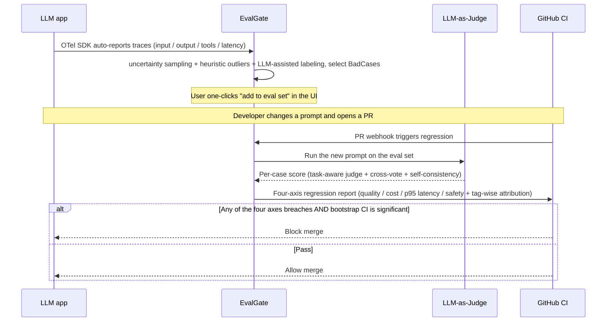
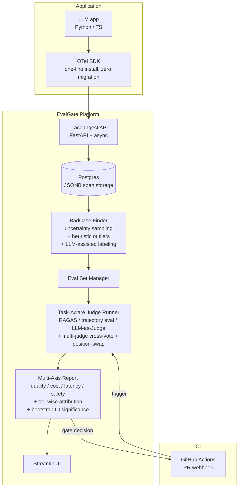
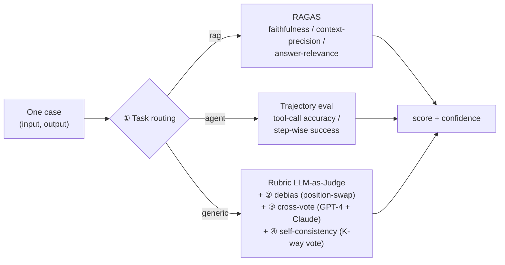
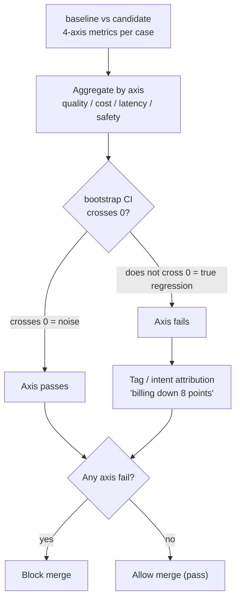

# EvalGate · Design Spec

> **Purpose**: The long-term **source of truth** for this project's product definition, tech choices, architecture, and key trade-offs.
>
> Detailed technical plans for each capability live in the matching `PHASE_*_PLAN.md` under [`docs/`](.); record each major technical decision in the root [`DECISIONS.md`](../DECISIONS.md) (ADR-style).
>
> **Internal codename**: EvalGate (used only in design docs and conversation; do not use this name on a resume — use "Eval-First LLMOps with CI Gate" as the project title).
>
> **One-liner**: A pipeline from production traces → uncertainty sampling to actively select BadCases → task-stratified evaluation → multi-axis CI gate (quality / cost / latency / safety, with bootstrap CI for significance) → tag-wise attribution that blocks bad PRs from shipping.
>
> **Peers**: OpenAI Applied Evals · Anthropic Model Evaluations · Cursor Agent Eval · LangSmith · Arize Phoenix · Comet Opik

---

## 1. Feature overview

### 1.1 Problem we solve

For LLM apps today, the team's pain is not "no eval tools" — it is **"no eval closed loop"**:

| Status quo (stitched OSS tools) | Real pain |
|---|---|
| Langfuse to inspect traces | After you look, what's next? Nobody tells you |
| OpenAI evals on a dataset | Where does the dataset come from? Who labels by hand? |
| LLM-as-Judge scripts | Re-run the full suite on every prompt change? |
| PR review by gut feel | "This prompt change didn't break anything, right?" Nobody is confident |

**EvalGate's positioning**: stitch those four tools into one pipeline — production traces in → **uncertainty sampling (active learning for low-confidence samples) + heuristic outliers + LLM-assisted labeling** to find BadCases → semi-automatically add them to the eval set → PRs trigger regression runs → a **four-axis gate (quality / cost / p95 latency / safety) + bootstrap CI for significance** blocks regressions → a **tag/intent attribution report** tells you "the billing-intent cluster collectively broke because of this prompt change," not just "pass rate dropped 3%."

### 1.2 Target users

- **Primary**: teams shipping LLM apps in production (ML Engineer + DevOps + small-team Tech Lead)
- **Secondary**: QA / eval teams (as a model-regression baseline)

### 1.3 Core user flow

### 1.4 Core differences vs comparable products

| Dimension | LangSmith / Phoenix | **EvalGate** |
|---|---|---|
| Primary capability | Trace browsing + prompt management | **Trace + eval closed loop** |
| Eval posture | Side feature | **Core feature** |
| Data flywheel | Partial (must trigger by hand) | **Automatic BadCase → eval set** |
| CI gate | SDK exists but off by default | **PR-triggered + blocking merge is the default** |
| Prompt management UI | Heavy | **Cut entirely (eval-focused)** |
| Protocol | Vendor-owned SDKs | **OTel-native (zero migration cost for the app)** |

**One-line differentiation**: others are "Trace-First LLMOps"; EvalGate is **"Eval-First LLMOps with CI Gate"** — the name *is* the positioning.

---

## 2. Tech stack

### 2.1 High-level architecture

### 2.2 Core component choices

| Component | Choice | Why (interview talking point) |
|---|---|---|
| Backend language | **Python + FastAPI + async** | Trace ingest is IO-heavy and high-throughput; async is required; FastAPI is the de facto standard in the LLM ecosystem |
| Database | **Postgres + JSONB + Alembic** | OTel span attributes are schema-flexible; JSONB keeps "flexible + SQL-queryable" vs NoSQL; Alembic evolves the schema |
| Trace protocol | **OpenTelemetry (OTLP)** | Industry open standard; the app installs an SDK and is in — **no vendor lock-in** (vs LangSmith's proprietary SDK) |
| Frontend | **Streamlit** | UI is ops-oriented (mostly data display); Streamlit is pick-up-in-a-week; spend the saved frontend time on backend depth |
| LLM calls | **LiteLLM** | One SDK for 100+ models; enables cross-family Judge cross-vote (GPT-4 + Claude dual vote to cut variance and self-preference bias) |
| Judge algorithm | **Task-stratified evaluator + multi-judge cross-vote + position-swap + self-consistency voting** | See Decision 2 — covers task heterogeneity + the three known biases listed in Zheng 2023 MT-Bench (position / verbosity / self-preference) |
| RAG eval | **Ragas (faithfulness / context-precision / answer-relevance)** | Industry-standard RAG eval library, used as the dedicated evaluator layer for RAG tasks |
| Agent eval | **Trajectory eval (tool-call accuracy + step-wise success)** | Agent output is an action sequence, not text; scoring only the final answer misses intermediate errors; step-wise eval is the standard in OpenAI/Anthropic Agent Eval papers |
| BadCase Finder | **Uncertainty sampling (active learning, ranked by Judge confidence) + heuristic outliers (latency / cost / user negative feedback) + LLM-assisted labeling** | Three-layer filter to prevent eval-set explosion and class imbalance: uncertainty sampling prefers samples the LLM Judge is unsure about (highest information), heuristics catch hard failures, LLM catches subtle quality issues |
| CI integration | **GitHub Actions workflow + REST API** | PR trigger is industry standard; REST API lets GitLab / Buildkite / Jenkins plug in |
| Deploy | **Docker Compose (demo) / AWS ECS Fargate + RDS (production demo, Terraform + GitHub OIDC)** | Learn cloud (resume gap); ECS is simpler than EKS — shipped in Phase 18; see [PHASE_18_PLAN.md](./PHASE_18_PLAN.md) and ADR-017 |

### 2.3 Key technical decisions (trade-offs)

> The full, append-only timeline of decisions is in the root [`DECISIONS.md`](../DECISIONS.md). This section is the four core decisions locked in at design time.

#### Decision 1: Why we cut the Prompt management UI

- **Temptation**: LangSmith has prompt hub + version diff + A/B test; it looks complete
- **Why we declined**: (1) red ocean (5+ OSS tools already do this), (2) shipping the UI doubles the work with zero differentiation
- **Alternative**: treat prompts as config (YAML / Python module); Git versions them naturally; this project only answers "how well does this prompt evaluate"

#### Decision 2: Why "task-stratified evaluator + multi-judge ensemble" instead of a single LLM-as-Judge

A single LLM-as-Judge is the 2026 baseline and has at least three known defects:

- **Problem 1 (variance)**: single-shot variance ±15% (same input scored differently across 3 runs)
- **Problem 2 (task heterogeneity)**: RAG faithfulness, Agent trajectory accuracy, and generic answer quality cannot share one rubric without distortion — RAG cares about faithful citations, Agent about correct action sequences, generic about answer quality itself
- **Problem 3 (known biases)**: Zheng 2023 MT-Bench systematically records three biases —
  - **position bias**: in A/B comparison, LLMs prefer a particular position
  - **verbosity bias**: preference for longer answers
  - **self-preference bias**: GPT-4 prefers GPT-4 outputs

**Four-part design**:

| Dimension | Approach |
|---|---|
| **Task stratification** | RAG → RAGAS (faithfulness / context-precision / answer-relevance); Agent → trajectory eval (tool-call accuracy + step-wise success); generic → LLM-as-Judge with rubric |
| **Debiasing** | position-swap (swap A/B twice and require agreement) + verbosity normalization (normalize by length) |
| **Multi-judge ensemble** | GPT-4 + Claude cross-family cross-vote (anti self-preference) |
| **Variance reduction** | Judge each case 3–5 times + majority vote + emit a confidence score |

Eval path for one case (task-stratify first; on the generic path, stack debias / cross-vote / variance reduction):

> Exact implementation nesting (`MultiJudge → SelfConsistencyJudge → PositionSwapJudge → leaf`) is in [`PHASE_6_PLAN.md`](./PHASE_6_PLAN.md).

- **Cost**: eval cost ×6–10 (vs single-shot LLM-as-Judge)
- **Benefit**:
  - Single-shot variance ±15% → **±3%**
  - Cohen's κ vs human ~0.65 → **~0.85+**, approaching the double-human κ ceiling (literature ~0.85–0.90)
  - One platform covers RAG / Agent / generic tasks, not chat-only

#### Decision 3: Why OTel instead of a proprietary SDK

- **Temptation**: a first-party SDK can carry richer metadata and a smoother UX
- **Why we declined**: (1) app integration cost comes first — OTel is an instrumentor install; (2) switching backends later (e.g. to Datadog) is zero-cost — **the enterprise selling point**
- **Cost**: we must write a mapper from OTel attributes → the internal data model

#### Decision 4: Why the CI Gate is "multi-axis + statistical significance + tag-wise attribution" instead of a single pass rate

A naive pass-rate gate (the default shape of OSS tools) fails in production in three ways:

- **Pitfall 1 (missed regressions)**: pass rate unchanged but cost doubles / P95 latency doubles / safety violations rise → UX is already broken, the gate stays silent
- **Pitfall 2 (false block)**: LLM eval is stochastic; 92% → 89% pass rate may be 3% noise; one false CI block and everyone starts `--force`-skipping the gate — **the system is dead**
- **Pitfall 3 (doesn't solve the problem)**: "pass rate dropped 3%" is an alarm, not a root cause; developers still have to dig traces to find which class of cases broke

**Three-part design**:

| Dimension | Approach |
|---|---|
| **Multi-axis gate** | quality (pass rate) / cost (token usage) / p95 latency / safety (PII + jailbreak violations) in parallel; any axis breach fails |
| **Significance test** | diffs use bootstrap CI (1000 resamples, 95% interval) or paired t-test; treat as a true regression only if the CI does not cross 0 — avoids stochastic-eval false blocks |
| **Tag-wise attribution** | each eval case is tagged (intent / domain / difficulty); regressions attribute by tag → "billing intent dropped 8 points," not "overall pass rate dropped 0.5%" |

Gate decision flow (run significance independently per axis; any fail blocks):

- **Cost**: tag hygiene + bootstrap compute (negligible; eval runtime dwarfs the significance test)
- **Benefit**: covers the four real production failure modes (missed regression / false block / unexplainable / single-point noise) and makes the CI gate something developers keep, not something they route around

---

## 3. Interview cheat sheet (30-second talking point ×5)

| # | Hash keyword | 30-second pitch |
|---|---|---|
| 1 | **Eval-First LLMOps** | "LLMOps tools today are trace-first, but the real production pain is: after a PR changes a prompt, nobody knows if there is a regression. I built an eval-first platform: traces in, uncertainty sampling actively picks BadCases, PRs trigger regression, then a **four-axis gate** (quality / cost / p95 latency / safety) + bootstrap CI for significance before we block merge, with tag-wise attribution down to concrete case clusters." |
| 2 | **OTel-native protocol** | "Zero migration cost for the app — install an OTel instrumentor and you're in; switching backends later has no vendor lock-in. That's what enterprise customers care about most." |
| 3 | **Task-stratified evaluator + multi-judge debiasing** | "Pure LLM-as-Judge is a 2023 baseline: single-shot variance ±15% plus the three known biases of position/verbosity/self-preference (Zheng 2023 MT-Bench). I built a task-stratified evaluator — RAG via RAGAS, Agent via trajectory eval, generic answers via rubric judge — then stacked GPT-4 + Claude cross-vote + position-swap debiasing + self-consistency voting. Variance down to ±3%, Cohen's κ vs human 0.85, approaching the double-human ceiling." |
| 4 | **Data flywheel + active-learning loop** | "trace → uncertainty sampling prefers low-confidence Judge samples → one-click BadCase into the eval set → multi-axis CI gate auto-runs regression → block regressions. Active learning is the point — you cannot dump every fail into the eval set (explosion + class imbalance)." |
| 5 | **Multi-axis CI Gate + significance + attribution** | "Not a single pass-rate gate — that's the novice shape. I built a **four-axis gate** (quality / cost / p95 latency / safety), diffs use **bootstrap CI for statistical significance** so stochastic eval doesn't false-block, and on block we **attribute by tag/intent** to concrete case clusters — 'billing intent dropped 8 points,' not 'pass rate dropped 0.5%.' Direct peer to the Cursor agent eval pipeline." |

## 4. Resume bullet draft

> Built an Eval-First LLMOps platform with OTel-native trace ingest, **uncertainty-sampled BadCase → eval set flywheel** (active learning over low-confidence Judge outputs to prevent eval set explosion), and a task-aware judge runner (RAGAS for RAG, trajectory eval for agents, rubric-based LLM-as-Judge for generic Q&A) layered with multi-judge cross-vote (GPT-4 + Claude), position-swap & verbosity debiasing (Zheng 2023 MT-Bench), and self-consistency voting — single-shot variance reduced from ±15% to ±3% and Cohen's κ vs human ~0.85, approaching the double-human κ ceiling. **PR-triggered multi-axis CI gate** (quality / cost / p95 latency / safety) with **bootstrap-CI significance testing** prevents stochastic-eval false blocks; regression reports surface **tag/intent-wise attribution** of degraded case clusters — not just a pass-rate drop. Drop-in OTel SDK works with Python and TypeScript apps.

> **Note**: this bullet has no concrete numbers (pass rate / κ / traffic); those must be filled from real project runs.

## 5. Open-source references (for learning; do not fork directly)

- `langfuse/langfuse` — most complete trace + eval data model
- `Arize-ai/phoenix` — OTel integration reference
- `openai/evals` — eval task abstractions + standard library
- `comet-ml/opik` — next-gen eval-first LLMOps (direct competitor)
- `promptfoo/promptfoo` — assertions DSL design
