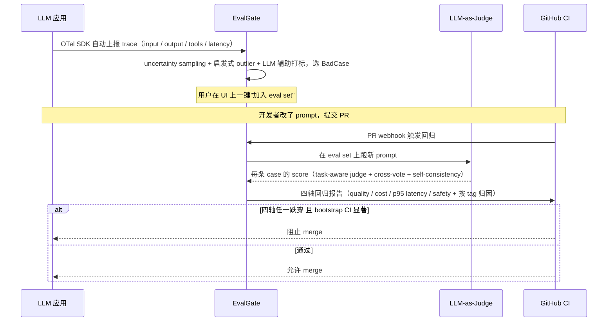
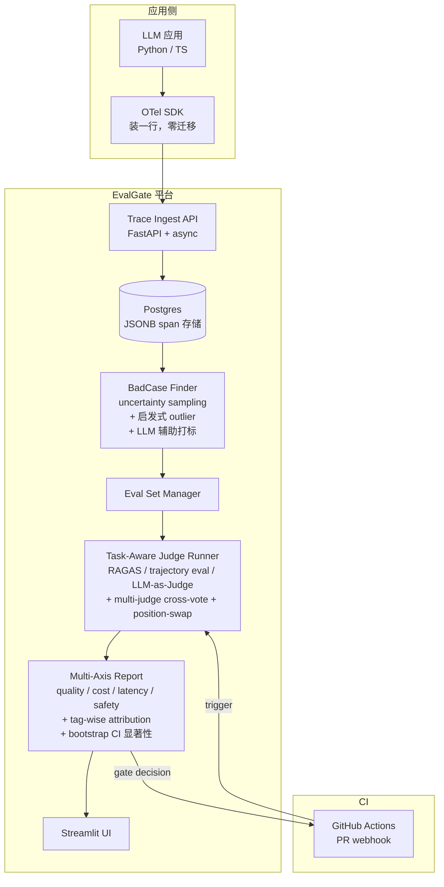
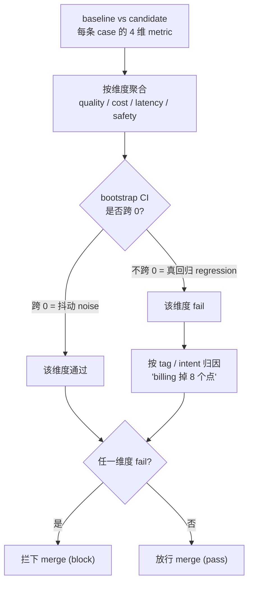

# EvalGate · Design Spec

> **作用**：本项目长期的产品定义 + 技术选型 + 架构 + 关键 trade-off（权衡取舍）的**唯一信息源（source of truth）**。
>
> 各能力的详细技术方案见 [`docs/`](.) 下对应的 `PHASE_*_PLAN.md`；每次重大技术抉择写入根目录 [`DECISIONS.md`](../DECISIONS.md)（ADR 风格）。
>
> **内部代号**：EvalGate（仅用于设计文档与对话；简历不出现此名，使用 "评测优先 LLMOps · Eval-First LLMOps with CI Gate" 作为项目标题）。
>
> **一句话**：把 LLM 应用的 "生产 trace → uncertainty sampling 主动选 BadCase → 任务分层评测 → 多轴 CI gate (quality / cost / latency / safety, bootstrap CI 判显著) → 按 tag 归因阻止 bad PR 上线" 做成一条流水线。
>
> **对标**：OpenAI Applied Evals · Anthropic Model Evaluations · Cursor Agent Eval · LangSmith · Arize Phoenix · Comet Opik

---

## 1. 功能总览

### 1.1 解决什么问题

现在的 LLM 应用，团队的痛点不是"没有评测工具"，而是 **"没有评测闭环"**：

| 现状（开源工具拼凑）| 真实痛点 |
|---|---|
| Langfuse 看 trace | 看完了下一步是什么？没人告诉你 |
| OpenAI evals 跑 dataset | dataset 怎么来？谁手工标？ |
| LLM-as-Judge 写脚本 | 每次改 prompt 都要重跑全套？ |
| PR review 凭感觉 | "这次改完 prompt 没坏吧？" 没人有信心 |

**EvalGate 的定位**：把上面 4 个工具串成一条流水线 — 生产 trace 进来 → **uncertainty sampling (主动学习选低置信度样本) + 启发式 outlier + LLM 辅助打标** 找 BadCase → 半自动加进 eval set → PR 触发跑回归 → **四轴 gate（quality / cost / p95 latency / safety）+ bootstrap CI 判显著**阻止劣化 → **按 tag/intent 归因报告**告诉你 "billing intent 的 case 类簇集体坏了，是这个 prompt 改动导致的"，而不只是 "pass rate 跌了 3%"。

### 1.2 目标用户

- **主用户**：在生产部署 LLM 应用的团队（ML Engineer + DevOps + 小团队 Tech Lead）
- **次用户**：QA / 评测团队（用做 model regression baseline）

### 1.3 核心用户流程

### 1.4 与对标产品的核心差异

| 维度 | LangSmith / Phoenix | **EvalGate** |
|---|---|---|
| 主功能 | Trace 浏览 + Prompt 管理 | **Trace + Eval 闭环** |
| 评测形态 | 附属 feature | **核心 feature** |
| 数据飞轮 | 部分（要手工触发）| **自动 BadCase → eval set** |
| CI gate | 有 SDK 但默认不开 | **PR-triggered + 阻塞 merge 是默认形态** |
| Prompt 管理 UI | 重 | **完全砍掉（聚焦评测）** |
| 协议 | 各家自己 SDK | **OTel-native（应用方零迁移成本）** |

**一句话差异**：别人是 "Trace-First LLMOps"，EvalGate 是 **"Eval-First LLMOps with CI Gate"**，名字本身就是定位。

---

## 2. 技术栈选型

### 2.1 整体架构

### 2.2 核心组件选型

| 组件 | 选型 | 为什么这么选（面试可讲） |
|---|---|---|
| 后端语言 | **Python + FastAPI + async** | trace ingest 是 IO-heavy 高吞吐场景，async 是必需；FastAPI 是 LLM 圈事实标准 |
| 数据库 | **Postgres + JSONB + Alembic** | OTel span 的 attributes 是不固定 schema，JSONB 比 NoSQL 兼顾"灵活 + 可 SQL"；Alembic 演进 schema |
| Trace 协议 | **OpenTelemetry (OTLP)** | 业界开放标准，应用方装个 SDK 就接入，**不会被 vendor lock-in**（vs LangSmith 自家 SDK） |
| 前端 | **Streamlit** | 本项目 UI 偏运维向（数据展示为主），Streamlit 1 周可上手；把节省的 Frontend 时间投到 backend 深度 |
| LLM 调用 | **LiteLLM** | 一个 SDK 调 100+ 模型；支撑 Judge 跨家族 cross-vote（GPT-4 + Claude 双投票降方差 + 防 self-preference bias） |
| Judge 算法 | **任务分层 evaluator + multi-judge cross-vote + position-swap + self-consistency voting** | 见决策 2 — 覆盖任务异质性 + Zheng 2023 MT-Bench 列出的三类 known biases（position / verbosity / self-preference） |
| RAG 评测 | **Ragas（faithfulness / context-precision / answer-relevance）** | 业界标准 RAG 评测库，作为 RAG 任务的专用 evaluator 层 |
| Agent 评测 | **Trajectory eval（tool-call accuracy + step-wise success）** | Agent 输出是动作序列不是文本，单测最终答案会漏掉中间错误；step-wise eval 是 OpenAI/Anthropic Agent Eval 论文标准做法 |
| BadCase Finder | **uncertainty sampling（主动学习，按 Judge confidence 排序）+ 启发式 outlier（latency / cost / 用户负反馈）+ LLM 辅助打标** | 三层过滤防 eval set 数据爆炸 + 类别失衡：uncertainty sampling 优先选 LLM Judge 不确定的样本（信息量最大），启发式抓硬故障，LLM 抓 subtle 质量问题 |
| CI 集成 | **GitHub Actions workflow + REST API** | PR 触发是业界标准；REST API 让 GitLab / Buildkite / Jenkins 都能接 |
| 部署 | **Docker Compose（demo）/ AWS ECS Fargate + RDS（生产 demo，Terraform + GitHub OIDC）** | 学 Cloud（简历缺失项），用 ECS 比 EKS 简单——Phase 18 已落地，见 [PHASE_18_PLAN.md](./PHASE_18_PLAN.md) 与 ADR-017 |

### 2.3 关键技术决策（trade-off）

> 完整、按时间线追加的决策记录见根目录 [`DECISIONS.md`](../DECISIONS.md)。本节是设计阶段确定的 4 条核心。

#### 决策 1：为什么砍掉 Prompt 管理 UI

- **诱惑**：LangSmith 有 prompt hub + version diff + A/B test，看起来很全
- **拒绝原因**：(1) 这是红海（5+ OSS 工具都做了），(2) 做完 UI 工作量翻倍但 differentiation 为零
- **替代方案**：把 prompt 当配置文件（YAML / Python module），Git 自然管版本；本项目只管 "评测这个 prompt 跑得怎么样"

#### 决策 2：为什么"任务分层 evaluator + 多 Judge 集成"而不是单一 LLM-as-Judge

单一 LLM-as-Judge 在 2026 是 baseline，至少有三个已知缺陷：

- **问题 1（方差）**：单次结果方差 ±15%（同样的 input 跑 3 次给不同分）
- **问题 2（任务异质）**：RAG faithfulness、Agent trajectory accuracy、通用回答 quality 三类用同一个 rubric 必然失真 — RAG 看引用是否忠实，Agent 看动作序列是否正确，通用看回答质量本身
- **问题 3（已知偏差）**：Zheng 2023 MT-Bench 论文系统记录的三类 bias —
  - **position bias**：A/B 比较时 LLM 偏好特定位置
  - **verbosity bias**：偏好长答案
  - **self-preference bias**：GPT-4 偏爱 GPT-4 输出

**四件套方案**：

| 维度 | 做法 |
|---|---|
| **任务分层** | RAG → RAGAS（faithfulness / context-precision / answer-relevance）；Agent → trajectory eval（tool-call accuracy + step-wise success）；通用 → LLM-as-Judge with rubric |
| **去偏** | position-swap（A/B 互换两次取一致）+ verbosity normalization（按长度归一）|
| **多 Judge 集成** | GPT-4 + Claude 跨家族 cross-vote（防 self-preference）|
| **降方差** | 每条 case Judge 跑 3-5 次 + 多数投票 + 输出 confidence score |

一条 case 的评测路径（先按任务分层，generic 路径再叠加去偏 / cross-vote / 降方差三层）：

> 实现层的精确嵌套拓扑（`MultiJudge → SelfConsistencyJudge → PositionSwapJudge → leaf`）见 [`PHASE_6_PLAN.md`](./PHASE_6_PLAN.md)。

- **代价**：评测成本 ×6-10（vs 单次 LLM-as-Judge）
- **收益**：
  - 单次方差 ±15% → **±3%**
  - Cohen's κ vs 人工 ~0.65 → **~0.85+**，逼近 double-human κ 上限（文献报告约 0.85-0.90）
  - 同一套 platform 覆盖 RAG / Agent / 通用三类任务，不是只能评 chat

#### 决策 3：为什么用 OTel 而不是自家 SDK

- **诱惑**：自家 SDK 可以塞更多 metadata，体验更好
- **拒绝原因**：(1) 应用方接入成本是首要考虑，OTel 装个 instrumentor 就能用；(2) 应用方未来想换 backend（比如换到 Datadog）零成本，**这是企业方案的关键卖点**
- **代价**：要写 OTel attribute → 内部数据模型的 mapper

#### 决策 4：为什么 CI Gate 是"多轴 + 统计显著性 + 按 tag 归因"而不是单 pass rate

简单 pass rate gate（市面 OSS 工具默认形态）在生产里会暴露三个坑：

- **坑 1（漏判）**：pass rate 不变但 cost 翻倍 / latency P95 涨 2 倍 / safety violation 增加 → 用户体验已经坏了，gate 不报
- **坑 2（误 block）**：LLM eval 本身是 stochastic 的，pass rate 92% → 89% 可能只是 3% 的随机抖动；如果 CI 误 block 一次，下次所有人会 `--force` 跳过 gate，**整个系统就废了**
- **坑 3（不解决问题）**："pass rate 跌了 3%" 是 alarm 不是 root cause；开发者还要自己翻 trace 找哪类问题坏了

**三件套方案**：

| 维度 | 做法 |
|---|---|
| **多轴 Gate** | quality (pass rate) / cost (token 消耗) / p95 latency / safety (PII + jailbreak 违规) 四轴并联，任一跌穿即 fail |
| **显著性判定** | diff 用 bootstrap CI（1000 次重采样取 95% 置信区间）或 paired t-test，CI 不跨 0 才算真 regression — 防 stochastic eval 误 block |
| **按 tag 归因** | 每条 eval case 打 tag（intent / domain / 难度级），回归时按 tag 维度归因 → "billing intent 跌了 8 个点" 而不是 "整体 pass rate 跌了 0.5%" |

gate 的判定流程（每个维度独立走一遍显著性判定，任一 fail 即拦截）：

- **代价**：tag 维护 + bootstrap 计算成本（可忽略，eval 本身耗时远大于显著性计算）
- **收益**：覆盖真实生产 4 类坑（漏判 / 误 block / 不可解释 / 单点抖动）+ 让 CI gate 是"开发者愿意保留"而不是"绕过去"的形态

---

## 3. 面试 Cheat Sheet（30 秒 talking point ×5）

| # | Hash 关键词 | 30 秒讲法 |
|---|---|---|
| 1 | **Eval-First LLMOps** | "现在 LLMOps 工具都是 trace-first，但生产里真痛点是 PR 改完 prompt 没人知道有没有 regression。我做了个 eval-first 平台，trace 进来用 uncertainty sampling 主动选 BadCase，PR 触发跑回归后**四轴 gate**（quality / cost / p95 latency / safety）+ bootstrap CI 判显著才 block merge，按 tag 归因到具体 case 类簇。" |
| 2 | **OTel-native 协议** | "应用方零迁移成本，装个 OTel instrumentor 就接入，未来想换 backend 也没 vendor lock-in。这是企业客户最在意的。" |
| 3 | **任务分层 evaluator + 多 Judge 去偏** | "纯 LLM-as-Judge 是 2023 baseline，单次方差 ±15% 还有 position/verbosity/self-preference 三类已知偏差（Zheng 2023 MT-Bench）。我做了任务分层 evaluator — RAG 走 RAGAS、Agent 走 trajectory eval、通用回答走 rubric judge，再叠加 GPT-4 + Claude cross-vote + position-swap 去偏 + self-consistency voting，方差降到 ±3%，Cohen's κ vs 人工 0.85，逼近 double-human 上限。" |
| 4 | **数据飞轮 + 主动学习闭环** | "trace → uncertainty sampling 优先选 Judge 低置信度样本 → 一键 BadCase 入 eval set → 多轴 CI gate 自动跑回归 → 阻止劣化。主动学习是关键 — 不能把所有 fail 都塞 eval set（会爆炸 + 类别失衡）。" |
| 5 | **多轴 CI Gate + 显著性 + 归因** | "不是单 pass rate gate — 那是新手做法。我做了**四轴 gate**（quality / cost / p95 latency / safety），diff 用 **bootstrap CI 判统计显著**防 stochastic eval 误 block，阻塞时**按 tag/intent 归因**到具体 case 类簇 — 'billing intent 跌了 8 个点' 而不是 'pass rate 跌了 0.5%'。直接对标 Cursor agent eval pipeline。" |

## 4. 简历 Bullet 草稿

> Built an Eval-First LLMOps platform with OTel-native trace ingest, **uncertainty-sampled BadCase → eval set flywheel** (active learning over low-confidence Judge outputs to prevent eval set explosion), and a task-aware judge runner (RAGAS for RAG, trajectory eval for agents, rubric-based LLM-as-Judge for generic Q&A) layered with multi-judge cross-vote (GPT-4 + Claude), position-swap & verbosity debiasing (Zheng 2023 MT-Bench), and self-consistency voting — single-shot variance reduced from ±15% to ±3% and Cohen's κ vs human ~0.85, approaching the double-human κ ceiling. **PR-triggered multi-axis CI gate** (quality / cost / p95 latency / safety) with **bootstrap-CI significance testing** prevents stochastic-eval false blocks; regression reports surface **tag/intent-wise attribution** of degraded case clusters — not just a pass-rate drop. Drop-in OTel SDK works with Python and TypeScript apps.

> **注**：bullet 里没有具体数字（pass rate / κ 值 / 流量），这些必须用项目实际跑出的真实数据填充。

## 5. 开源参考（学习用，不直接 fork）

- `langfuse/langfuse` — trace + eval 数据模型最完整
- `Arize-ai/phoenix` — OTel 集成参考
- `openai/evals` — eval task 抽象 + 标准库
- `comet-ml/opik` — 新一代 eval-first LLMOps（直接竞品）
- `promptfoo/promptfoo` — assertions DSL 设计
